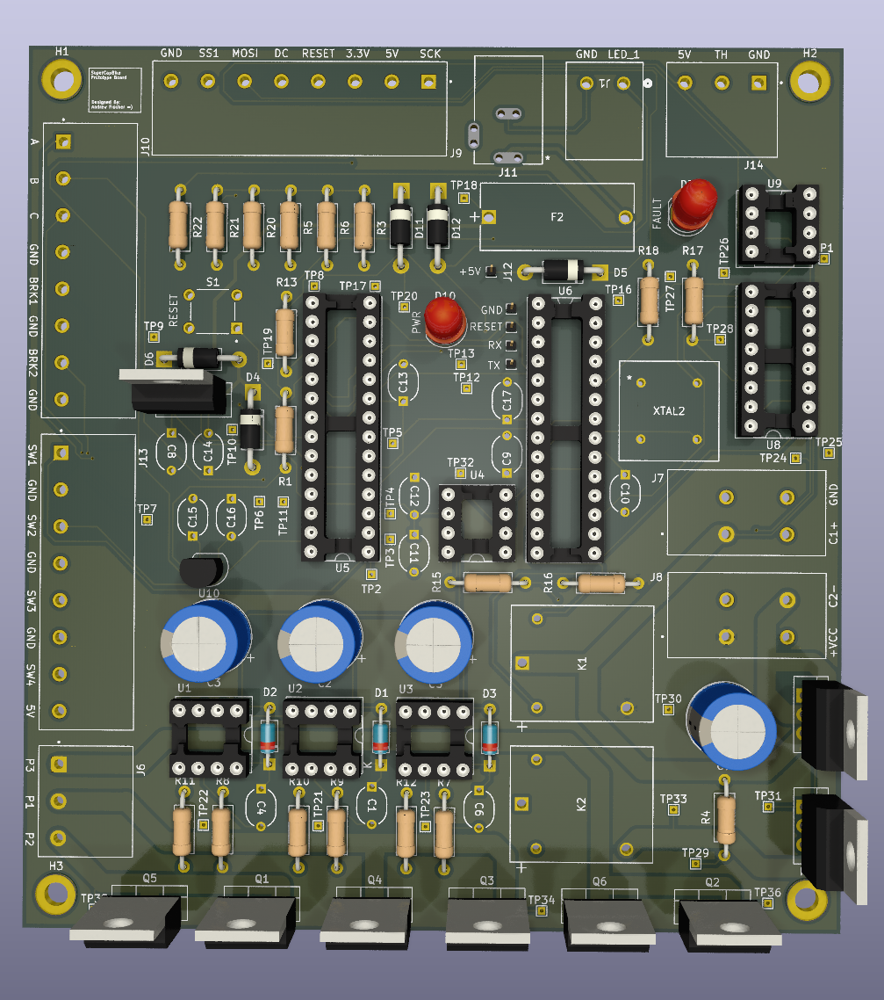

# This repository contains all the hardware needed for my supercapacitor bike.

## Main Features

  A 2 x ((500F @ 2.7V) x 6)  super-capacitor bank-based accumulator:
  
      1. Ability to provide high amounts of current instantaneously.
      
        This is well suited for my application where immediate throttle response is required. 
        The instant delivery of torque allows for aggressive accelerations when 
        changing from a low throttle position to full throttle.  

      2. Much more durable than a traditional battery.
        
        The super-capacitors can withstand many more full charge and discharge cycles
        without degradation. As such, they will undergo many charging cycles through 
        sources such as regenerative braking. Long service life is a priority.
      
      3. Quick charge times.

        Since super-capacitors have significantly less charge density than a battery, 
        it results in faster charging times. The primary intent is to only discharge 
        the super-capacitors to assist in climbing a hill.

  Series-Parallel Switching:

    This allows for a much more dynamic control over the power delivery from the super-capacitors. 
    To maximize runtime, the capacitors can be placed in parallel. 
    When the capacitors are getting low, or a large amount of power is required, 
    they can be switched into series. 

  More specific details can be found [here](https://www.desmos.com/calculator/0xlkaikos0).
    
## Current Components List

Ceramic Capacitors: 
- 0.1uF x 7 [^1], 
- 0.33uF x 2 [^2],
- 1uF x 3 [^3]

Electrolytic capacitors: 
- 10uF x 4 [^4]
  
Diodes:
- 1N4148 x 3 [^5], 
- 1N5819 x 5 [^6]

LEDs: 
- 5.0mm THT x2 [^7]

Fuse: 
- 0225002.MXP x1 [^8], 
- F4658-ND x 1 [^9]

Sockets & Pins: 
- 1x01 1.00mm Vertical Male Pin x 5 [^10], 
- 8 Dip 7.62mm Socket x 5 [^11],
- 16 Dip 7.62mm Socket x 1 [^12], 
- 28 Dip 7.62mm Socket x2 [^13] 

Barrel Jack: 
- PJ_002AH x 1 [^14]

Relays: 
- AWHSH105D00G x 2 [^15]

MOSFETS:
- IRFZ44N x 7 [^16], 
- GT065P06T x 1 [^17]

Resistors: 
- 220Ω, 10kΩ, 25kΩ, 55kΩ Resistor Kit: [^18]

Terminals: 
- 1988804 x 1 [^19], 
- 1988817 x 2 [^20], 
- 1190363 x2  [^21], 
- 1988862 x 3 [^22]

Microprocessors: 
- ATMEGA328P x 1 [^23]

Crystal Oscillator: 
- MXO45HST-3C-16M000000 x 1 [^24]

GPIO Expander: 
- MCP23017 x 1 [^25]

Button: 
- TS02-66-50-BK-160-LCR-D x 1 [^26]

MOSFET Gate Driver: 
- UCC37324P x 1 [^27] *OPTIONAL*

Darlington Transistors Array: 
- ULN2003 x 1 [^28]

Digital Potentiometers: 
- MCP4151 x 1 [^29]

Half Bridge Drivers: 
- IR2104 x 3 [^30]

Linear Regulators: 
-L7805 x1 [^31], 
- L78L33 x1 [^32]

Hall Effect Sensors: 
- TMAG5213AGQLPG x 3 [^33]

Switches: 
- 2057-SW-R-K1-A-ND x 1 [^34] 

Total raw components cost: **$ 114.69 CAD**

*Note: The prices here show the price for the exact number of the components listed. They were not entirely optimized. It would be significantly cheaper if components were bought in bulk*

## Schematic and PCB

### Schematic:  

  To reduce image congestion, please clone the repository and access the schematic on Kicad V8+.

### PCB:

  
  

## FAQ

  -Q: Why are you using only through-hole components?
  
  -A: Since some of these components are new to me, I wanted to be able to quickly set up and re-arrange components on a breadboard so I can fiddle and experiment with them.

  -Q: Why did you choose to design your PCB only with 2 layers?
  
  -A: As the current PCB is only a prototype, I did my best to mitigate EMI, however, I was not too overly concerned with it. I am considering isolating analog and digital ground. My main focus is to test my circuit design on a 2-layer 1oz copper pour PCB and see if any issues need addressing before proceeding to designing a more expensive 2oz copper 4-layer PCB.

  -Q: Why are you using a dedicated MOSFET driver IC to control Q8?
  
  -A: Admittedly, this component is completely optional and absolutely can be replaced with a simple current limiting resistor. Naturally, this does affect the switching speed of the transistor, and I want to maximize performance. I have the IC in hand, and the favourable transient response led me to implement it into my circuit.

  -Q: Why the relays?
  
  -A: I was able to simulate and build a circuit that switches two capacitors in series or parallel with only MOSFETS, however the performance when V_GS < ~4V was inadequate. Additionally, diodes were required to prevent reverse currents from connecting C2- to GND. As such, relays had significantly greater performance when switching the super-capacitors into parallel. I still kept Q7 and Q8 to switch the capacitors into series as a tribute to what I have learned from my experience with MOSFETs.

  -Q: Why did you choose the IRFZ44N?
  
  -A: The IRFZ44N is a widely used, affordable n-type MOSFET, as of which I have many on hand. I am well within the limitations of the drain current I_D, and drain source voltage V_DS. It has a favourable characteristic of only needing a V_GS of ~5.5V to supply 10A at a V_DS of ~ 0.3V. All transients were more than acceptable with the chosen MOSFET drivers for my         application.  

  -Q: Why did you choose the GT065P06T?
  
  -A: I chose the GT065P06T primarily due to its outstanding R_DS of < 11mΩ at V_GS -4.5V for a p-type MOSFET and low gate charge. When the capacitors are in series, I want to minimize the power dissipated through that MOSFET without using PWM. 

## What I am Working on Now

I am currently installing the Hall effect sensors into the motor. The previous sensors were faulty and only outputted an average analog voltage of +3mV. An attempt was made to filter the signal from significant noise with the use of Schmitt triggers, however, this added significantly more complexity and cost. A replacement of the sensors was deemed to be the optimal solution.

## Personal Note

Somehow I managed to get sick twice throughout the last two months! I am doing my best to balance schoolwork and look over my design. I hope to have the PCB ordered by the end of this week (2024/10/20). Please Stay tuned! I am still pushing through and doing all I can =)!

## Sources

[^1]: https://www.digikey.ca/en/products/detail/kemet/C322C104M5U5TA/818107
[^2]: https://www.digikey.ca/en/products/detail/kemet/C330C334M5R5TA/6562403
[^3]: https://www.digikey.ca/en/products/detail/kemet/C330C105K5R5TA7301/3726162
[^4]: https://www.digikey.ca/en/products/detail/cornell-dubilier-knowles/106CKE400M/5410625
[^5]: https://www.digikey.ca/en/products/detail/onsemi/1N4148/458603
[^6]: https://www.digikey.ca/en/products/detail/stmicroelectronics/1N5819/1037326
[^7]: https://www.digikey.ca/en/products/detail/marktech-optoelectronics/MT4118-HR-A/4214622
[^8]: https://www.digikey.ca/en/products/detail/littelfuse-inc/02540101Z/553102
[^9]: https://www.digikey.ca/en/products/detail/littelfuse-inc/0225002-MXP/777781
[^10]: https://www.digikey.ca/en/products/detail/samtec-inc/TS-101-T-A/1105493
[^11]: https://www.digikey.ca/en/products/detail/te-connectivity-amp-connectors/1-2199298-2/5022039
[^12]: https://www.digikey.ca/en/products/detail/on-shore-technology-inc/ED16DT/4147596
[^13]: https://www.digikey.ca/en/products/detail/adam-tech/ICS-328-T/9832859
[^14]: https://www.digikey.ca/en/products/detail/same-sky/PJ-002AH/408446
[^15]: https://www.digikey.ca/en/products/detail/amphenol-anytek/AWHSH105D00G/16721986
[^16]: https://www.digikey.ca/en/products/detail/umw/IRFZ44N/24889964
[^17]: https://www.digikey.ca/en/products/detail/goford-semiconductor/GT065P06T/18088004
[^18]: https://www.digikey.ca/en/products/detail/sparkfun-electronics/COM-10969/14671649
[^19]: https://www.digikey.ca/en/products/detail/phoenix-contact/1988804/950892
[^20]: https://www.digikey.ca/en/products/detail/phoenix-contact/1988817/950893
[^21]: https://www.digikey.ca/en/products/detail/phoenix-contact/1190363/14680902
[^22]: https://www.digikey.ca/en/products/detail/phoenix-contact/1988862/950898
[^23]: https://www.digikey.ca/en/products/detail/microchip-technology/ATMEGA328P-PN/2357094
[^24]: https://www.digikey.ca/en/products/detail/cts-frequency-controls/MXO45HST-3C-16M000000/1801910
[^25]: https://www.digikey.ca/en/products/detail/microchip-technology/MCP23017-E-SP/894272
[^26]: https://www.digikey.ca/en/products/detail/same-sky-formerly-cui-devices/TS02-66-50-BK-160-LCR-D/15634352?s=N4IgTCBcDaICoGUAMYC0A2dqCsTUCEBpVARnTwBkBhAJVQBEACEAXQF8g
[^27]: https://www.digikey.ca/en/products/detail/texas-instruments/UCC37324P/571464
[^28]: https://www.digikey.ca/en/products/detail/stmicroelectronics/ULN2003A/599603
[^29]: https://www.digikey.ca/en/products/detail/microchip-technology/MCP4151-103E-P/1874217
[^30]: https://www.digikey.ca/en/products/detail/infineon-technologies/IR2104PBF/812198
[^31]: https://www.digikey.ca/en/products/detail/stmicroelectronics/L7805CV/585964
[^32]: https://www.digikey.ca/en/products/detail/stmicroelectronics/L78L33ABZ-AP/1663442
[^33]: https://www.digikey.ca/en/products/detail/texas-instruments/TMAG5213AGQLPG/22531584
[^34]: https://www.digikey.ca/en/products/detail/adam-tech/SW-R-K1-A/15284469
